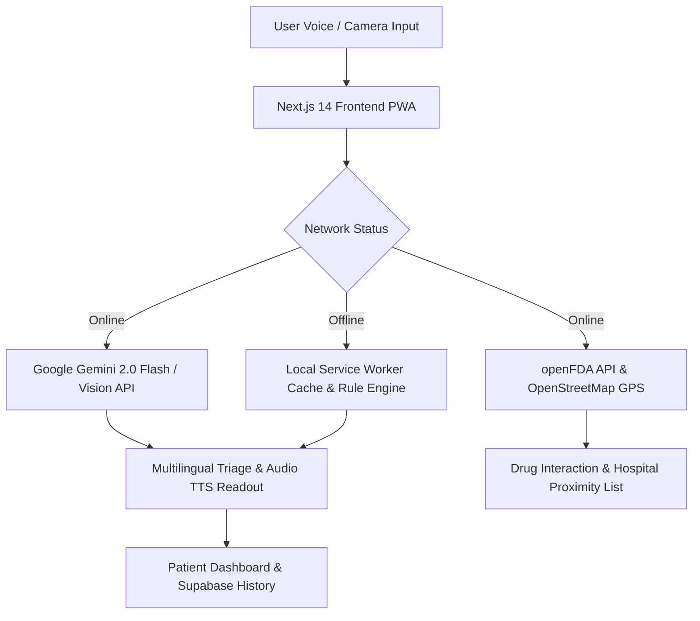

```
 __  __          _ _ __  __ _ _| |_ _ __ a _     _    ___ 
|  \/  | ___  __| (_)  \/  (_) |_| '__/ _` |    / \  |_ _|
| |\/| |/ _ \/ _` | | |\/| | | __| | | (_| |   / _ \  | | 
|_|  |_|\___/\__,_|_|_|  |_|_|\__|_|  \__,_|  /_/   \_\___|
```

# 🏥 MediMitra AI — Your AI Health Companion

> **CodeStorm 2026 #2 Flagship Project Submission**  
> *"Speaks Your Language, Understands Your Needs, Saves Lives"*

[](https://dhanya-medimitra.vercel.app)
[](https://nextjs.org/)
[](https://ai.google.dev/)
[](https://www.typescriptlang.org/)
[](https://tailwindcss.com/)
[](https://web.dev/progressive-web-apps/)
[](LICENSE)

---

## 🚀 Live Demo & Presentation

- 🌐 **Live Web Application**: **[https://dhanya-medimitra.vercel.app](https://dhanya-medimitra.vercel.app)**
- 📺 **Interactive AI Pitch Video Presenter**: **[https://dhanya-medimitra.vercel.app/demo-video](https://dhanya-medimitra.vercel.app/demo-video)**
- 🐙 **GitHub Repository**: **[https://github.com/Dhanya-jm024/medimitra-ai](https://github.com/Dhanya-jm024/medimitra-ai)**

---

## 📌 Problem Statement

In rural India today, **700 million people** face a critical healthcare deficit:
- 🚨 **1:10,000 Doctor-to-Patient Ratio**: 10 times worse than the WHO recommended baseline (1:1,000).
- 🗣️ **Language & Illiteracy Barriers**: Over 70% of rural citizens cannot comprehend English medical prescriptions or complex medical jargon.
- ⏳ **Delayed Emergency Triage**: Minor preventable infections escalate into life-threatening emergencies because families cannot recognize early warning signs.
- 📡 **Network Dead Zones**: Rural clinics frequently experience total Internet outages, breaking online-only health platforms.

### 👤 User Persona: Meet Lakshmi (Age 62)
Lakshmi lives in rural Karnataka. She developed a high fever at midnight. She cannot read English, and her nearest clinic is 25 km away over unpaved roads. With **MediMitra AI**, she simply taps one microphone button and speaks in her native Kannada. In 2 seconds, Gemini 2.0 Flash diagnoses her symptoms, provides home care steps, and **reads the diagnosis out loud in Kannada**.

---

## 💡 Solution & Key Innovations

**MediMitra AI** is a multilingual, voice-first AI health companion designed specifically for low-literacy and rural users.

1. **Voice-First Indic NLP**: Speech-to-Text & Text-to-Speech across 10+ Indic languages.
2. **Multimodal Gemini 2.0 Vision**: Camera OCR pill packaging scan cross-checked with openFDA for drug safety warnings.
3. **Global Satellite GPS Emergency SOS**: Continuous GPS tracking with OpenStreetMap radar, dynamic Haversine distance calculations, and 1-tap Twilio SMS emergency dispatch.
4. **Inclusive Accessibility**: WCAG AAA High Contrast mode and dynamic font scaling (**A- / A / A+**).
5. **100% PWA Offline Mode**: Service Worker caching for zero-connectivity rural zones.

---

## ✨ Feature Breakdown

<details>
<summary><b>🎙️ 1. Multilingual Voice Symptom Checker</b></summary>
<br>

- Speak symptoms naturally in English, Hindi (हिन्दी), Kannada (ಕನ್ನಡ), Tamil (தமிழ்), or Telugu (తెలుగు).
- Powered by **Google Gemini 2.0 Flash** for condition probability %, confidence meters, home remedies, and urgency levels.
- **Audible Readout (TTS)** for visually impaired and low-literacy patients.
</details>

<details>
<summary><b>💊 2. AI Medicine & Prescription Scanner</b></summary>
<br>

- Upload or take a picture of any pill strip or prescription label.
- **Gemini Vision OCR** extracts active compounds, dosage guidelines, and cross-checks **openFDA API** for dangerous drug interactions.
</details>

<details>
<summary><b>🩺 3. Vision Skin & Wound Assessment</b></summary>
<br>

- Visual dermatological scan for skin rashes, allergic reactions, and superficial cuts.
- Classifies severity (Mild / Moderate / Severe) and provides instant step-by-step first aid protocols.
</details>

<details>
<summary><b>🚨 4. Global Satellite GPS Emergency SOS</b></summary>
<br>

- Persistent floating **Red SOS Button**.
- HTML5 Geolocation streams high-precision coordinates (`navigator.geolocation.watchPosition`).
- Overpass OpenStreetMap API queries real nearby hospitals globally and ranks them by Haversine distance.
- 1-tap Twilio SMS broadcast to registered emergency contacts and 108 ambulance dispatch.
</details>

<details>
<summary><b>♿ 5. Inclusive Accessibility & PWA Offline</b></summary>
<br>

- **WCAG AAA High Contrast Mode** & dynamic font scaling (**A- / A / A / A+**).
- **Service Worker PWA Caching** for zero-connectivity rural dead zones.
</details>

---

## 🛠️ Tech Stack

| Category | Technology | Version | Purpose |
| :--- | :--- | :--- | :--- |
| **Frontend Core** | Next.js App Router | `14.2.23` | Serverless Edge Rendering & Static Page Generation |
| **UI Framework** | React / TypeScript | `18.3` / `5.0` | Type-Safe Component Architecture |
| **Styling** | Tailwind CSS | `3.4.17` | Utility-First Design & Dark Mode |
| **Icons & Motion** | Lucide React / Framer Motion | `0.344` / `11.0` | UI Icons & Smooth Micro-Animations |
| **Charts** | Recharts | `2.15.4` | Patient Telemetry & Heart Rate Visualizations |
| **AI Triage & Vision** | Google Gemini API | `2.0 Flash` | Multilingual NLP Triage & Vision OCR |
| **Backend API** | FastAPI (Python) | `0.110.0` | Python RAG Service & Medical Knowledge Engine |
| **Database & Auth** | Supabase | PostgreSQL | User Profiles, Symptom History & RLS Security |
| **Emergency APIs** | openFDA / OpenStreetMap / Twilio | REST APIs | Drug Interaction, GPS Mapping & SOS SMS |
| **Hosting & CI/CD** | Vercel Edge | Production | Global CDN & Serverless Deployments |

---

## 🏗️ System Architecture & Data Flow



---

## ⚙️ Installation & Setup

### Prerequisites
- Node.js `v18.0.0` or higher
- npm `v9.0.0` or higher
- Google Gemini API Key ([Get Free Key](https://aistudio.google.com/apikey))

### Step-by-Step Local Setup

1. **Clone the repository**:
   ```bash
   git clone https://github.com/Dhanya-jm024/medimitra-ai.git
   cd medimitra-ai
   ```

2. **Configure Environment Variables**:
   Create a `.env.local` file inside `frontend/`:
   ```bash
   cp .env.example frontend/.env.local
   ```
   Add your keys:
   ```env
   GEMINI_API_KEY=your_gemini_api_key_here
   NEXT_PUBLIC_GEMINI_API_KEY=your_gemini_api_key_here
   NEXT_PUBLIC_SUPABASE_URL=https://your-project.supabase.co
   NEXT_PUBLIC_SUPABASE_ANON_KEY=your_supabase_anon_key
   ```

3. **Install Dependencies & Run Development Server**:
   ```bash
   cd frontend
   npm install
   npm run dev
   ```
   Open **[http://localhost:3000](http://localhost:3000)** in your browser.

4. **Launch Optional Python FastAPI Backend**:
   ```bash
   cd ../backend
   pip install -r requirements.txt
   uvicorn app.main:app --reload --port 8000
   ```

---

## 📖 API Documentation

### 1. Symptom Triage (`POST /api/chat`)
- **Payload**:
  ```json
  {
    "symptoms": " तेज बुखार और सिरदर्द",
    "language": "hi"
  }
  ```
- **Response**:
  ```json
  {
    "condition": "मौसमी वायरल बुखार (Seasonal Influenza)",
    "confidence": 94,
    "riskLevel": "MODERATE",
    "summary": "आपके लक्षण मौसमी वायरल संक्रमण की ओर इशारा करते हैं।",
    "recommendedActions": ["पर्याप्त पानी पिएं", "आराम करें"],
    "homeRemedies": ["अदरक और हल्दी की चाय", "गरारे करें"]
  }
  ```

---

## 🔮 Roadmap & Version 2.0

- [x] **Phase 1**: Voice STT/TTS in 10+ Indic languages, Gemini Vision Pill Scanner, Global GPS SOS.
- [ ] **Phase 2**: Ayushman Bharat (ABDM) Health ID Integration & E-Prescriptions.
- [ ] **Phase 3**: Bluetooth IoT Wearable Sync (Pulse Oximeters & BP Cuffs).
- [ ] **Phase 4**: Feature Phone WhatsApp / Offline SMS Bot Gateway.

---

## 🤝 Contributing

Contributions are welcome! Please review [CONTRIBUTING.md](CONTRIBUTING.md) for pull request conventions and code of conduct.

---

## 📜 License

Distributed under the **MIT License**. See [LICENSE](LICENSE) for details.

---

## 🙏 Acknowledgments

- **CodeStorm 2026 #2 Hackathon Organizers**
- **Google DeepMind & Gemini AI Team**
- **OpenStreetMap & openFDA Communities**
