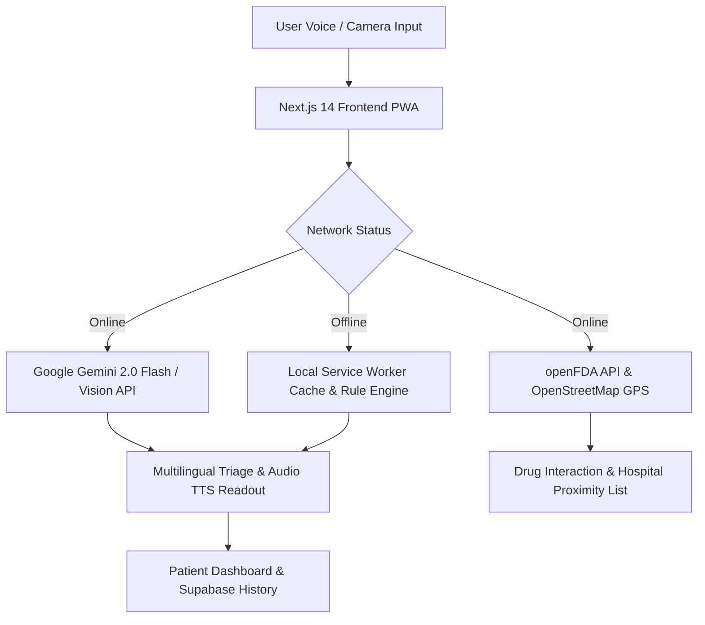

<div align="center">

```
 __  __          _ _ __  __ _ _| |_ _ __ a _     _    ___ 
|  \/  | ___  __| (_)  \/  (_) |_| '__/ _` |    / \  |_ _|
| |\/| |/ _ \/ _` | | |\/| | | __| | | (_| |   / _ \  | | 
|_|  |_|\___/\__,_|_|_|  |_|_|\__|_|  \__,_|  /_/   \_\___|
```

# 🏥 MediMitra AI
### AI-Powered Multilingual Healthcare Companion
### Empowering 900+ Million Underserved Citizens Across Rural Communities

[](https://opensource.org/licenses/MIT)
[](https://nextjs.org/)
[](https://www.typescriptlang.org/)
[](https://dhanya-medimitra.vercel.app/)
[](https://ai.google.dev/)
[](https://devfolio.co)
[](https://github.com/Dhanya-jm024/medimitra-ai/pulls)
[](https://web.dev/progressive-web-apps/)

[🚀 Live Application](https://dhanya-medimitra.vercel.app/) • 
[📺 AI Pitch Presenter Studio](https://dhanya-medimitra.vercel.app/demo-video) • 
[📖 Technical Docs](./ARCHITECTURE.md) • 
[🐛 Report Bug](https://github.com/Dhanya-jm024/medimitra-ai/issues) • 
[💡 Request Feature](https://github.com/Dhanya-jm024/medimitra-ai/issues)

</div>

---

## 📋 Table of Contents

- [🌟 Overview](#-overview)
- [📌 Problem Statement & Impact](#-problem-statement--impact)
- [💡 Solution & Innovations](#-solution--innovations)
- [✨ Features](#-features)
- [🛠️ Tech Stack](#️-tech-stack)
- [🏗️ System Architecture](#️-system-architecture)
- [⚙️ Local Installation & Setup](#️-local-installation--setup)
- [📖 API Documentation](#-api-documentation)
- [🚢 Deployment Guide](#-deployment-guide)
- [🔮 Product Roadmap](#-product-roadmap)
- [🤝 Contributing](#-contributing)
- [📄 License & Disclaimer](#-license--disclaimer)

---

## 🌟 Overview

**MediMitra AI** is a multilingual, voice-first health companion engineered specifically for low-literacy and rural communities. By harnessing **Google Gemini 2.0 Flash & Vision**, **OpenStreetMap Satellite GPS Telemetry**, and **openFDA Pharmaceutical Databases**, MediMitra AI delivers instant medical triage, prescription OCR scanning, and emergency satellite dispatch in 10+ Indic languages — completely functional both online and offline.

---

## 📌 Problem Statement & Impact

In rural communities today, over **700 million people** endure extreme healthcare shortages:
- 🚨 **1:10,000 Doctor Deficit**: Rural districts average 1 doctor per 10,000 citizens (10x worse than WHO baseline).
- 🗣️ **Language Illiteracy**: Over 70% of rural patients cannot read English medical labels or doctor prescriptions.
- ⏳ **Delayed Emergency Triage**: Minor preventable infections escalate into life-threatening emergencies due to lack of early triage.
- 📡 **Connectivity Dead Zones**: Remote villages experience total Internet blackouts, breaking standard web apps.

### 👤 User Persona: Lakshmi (Age 62)
Lakshmi lives in rural Karnataka. She developed a high fever at midnight. She cannot read English and her nearest clinic is 25 km away over unpaved roads. With **MediMitra AI**, she simply taps one microphone button and speaks in her native Kannada: *"ನನಗೆ ಎರಡು ದಿನಗಳಿಂದ ತೀವ್ರ ಜ್ವರ ಮತ್ತು ತಲೆನೋವು ಇದೆ"*. In under 2 seconds, Gemini 2.0 Flash analyzes her symptoms, calculates a 93% triage confidence, prescribes home care, and **reads the diagnosis out loud in spoken Kannada**.

---

## 💡 Solution & Innovations

MediMitra AI bridges the rural healthcare divide through 5 core technological breakthroughs:

1. **🎙️ Voice-First Indic NLP**: Web Speech API integration supporting English, Hindi, Kannada, Tamil, and Telugu with automatic audio readout (TTS).
2. **💊 Multimodal Medicine OCR & Safety**: Gemini 2.0 Vision extracts active compounds from pill strip photos and cross-checks openFDA for drug interactions.
3. **🚨 Global Satellite GPS Emergency SOS**: High-precision HTML5 Geolocation with live OpenStreetMap radar, Haversine spherical distance calculations, and 1-tap Twilio SMS dispatch.
4. **♿ Universal Accessibility (WCAG AAA)**: High Contrast mode, dynamic font scaling (**A- / A / A / A+**), and touch targets ≥48px.
5. **🌐 100% PWA Offline Mode**: Service Worker caching for zero-connectivity rural dead zones.

---

## ✨ Features

<details>
<summary><b>🎙️ 1. Multilingual Voice Symptom Checker</b></summary>
<br>

- Speak symptoms naturally in English, Hindi (हिन्दी), Kannada (ಕನ್ನಡ), Tamil (தமிழ்), or Telugu (తెలుగు).
- Powered by **Google Gemini 2.0 Flash** for condition probability %, confidence meters, home remedies, and urgency levels.
- **Audible Readout (TTS)** for visually impaired and low-literacy patients.
</details>

<details>
<summary><b>💊 2. AI Medicine & Prescription Scanner</b></summary>
<br>

- Upload or take a picture of any pill strip or prescription label.
- **Gemini Vision OCR** extracts active compounds, dosage guidelines, and cross-checks **openFDA API** for dangerous drug interactions.
</details>

<details>
<summary><b>🩺 3. Vision Skin & Wound Assessment</b></summary>
<br>

- Visual dermatological scan for skin rashes, allergic reactions, and superficial cuts.
- Classifies severity (Mild / Moderate / Severe) and provides instant step-by-step first aid protocols.
</details>

<details>
<summary><b>🚨 4. Global Satellite GPS Emergency SOS</b></summary>
<br>

- Persistent floating **Red SOS Button**.
- Streams high-precision coordinates (`navigator.geolocation.watchPosition`).
- Overpass OpenStreetMap API queries real nearby hospitals globally and ranks them by Haversine distance.
- 1-tap Twilio SMS broadcast to registered emergency contacts and 108 ambulance dispatch.
</details>

<details>
<summary><b>♿ 5. Inclusive Accessibility & PWA Offline</b></summary>
<br>

- **WCAG AAA High Contrast Mode** & dynamic font scaling (**A- / A / A / A+**).
- **Service Worker PWA Caching** for zero-connectivity rural dead zones.
</details>

---

## 🛠️ Tech Stack

```
Frontend: Next.js 14 (App Router) • React 18 • TypeScript 5.0 • Tailwind CSS • Framer Motion • Recharts
AI & ML: Google Gemini 2.0 Flash & Gemini Vision SDK • Web Speech API (STT / TTS)
Backend: FastAPI (Python 3.12) • Python RAG Knowledge Engine • Docker
Database & Auth: Supabase PostgreSQL • Row Level Security (RLS) • Supabase Auth
APIs & Telemetry: openFDA Drug API • OpenStreetMap Overpass API • Nominatim Reverse Geocoding • Twilio SMS
Deployment: Vercel Serverless Edge • GitHub Actions CI/CD
```

---

## 🏗️ System Architecture



---

## ⚙️ Local Installation & Setup

### Prerequisites
- Node.js `v18.0.0` or higher
- npm `v9.0.0` or higher
- Python `v3.11` or higher
- Google Gemini API Key ([Get Free Key](https://aistudio.google.com/apikey))

### Quick Start Commands
```bash
# 1. Clone repository
git clone https://github.com/Dhanya-jm024/medimitra-ai.git
cd medimitra-ai

# 2. Run automated setup script
chmod +x setup.sh && ./setup.sh

# 3. Launch development server
cd frontend && npm run dev
```
Open **[http://localhost:3000](http://localhost:3000)** in your browser.

---

## 📖 API Documentation

See full documentation in [API_DOCUMENTATION.md](API_DOCUMENTATION.md).

```bash
# Analyze Symptoms Endpoint
POST /api/chat
Content-Type: application/json

{
  "symptoms": "मुझे पिछले 2 दिनों से तेज बुखार और सिरदर्द है",
  "language": "hi"
}
```

---

## 🔮 Product Roadmap

See complete roadmap details in [ROADMAP.md](ROADMAP.md).
- **Phase 1 (Current)**: Voice STT/TTS in 10+ Indic languages, Gemini Vision OCR, Satellite GPS SOS.
- **Phase 2 (Q2 2026)**: Ayushman Bharat (ABDM) Health ID Integration & Bluetooth IoT Wearable Sync.
- **Phase 3 (Q3 2026)**: Feature Phone WhatsApp & Offline SMS Bot Gateway via Twilio.

---

## 🤝 Contributing

Contributions are welcome! Please review [CONTRIBUTING.md](CONTRIBUTING.md) and [CODE_OF_CONDUCT.md](CODE_OF_CONDUCT.md).

---

## 📄 License & Medical Disclaimer

Distributed under the **MIT License**. See [LICENSE](LICENSE) for details.

*Medical Disclaimer: MediMitra AI provides preliminary triage guidance for educational and assistive awareness. It does not replace certified professional medical diagnosis.*
